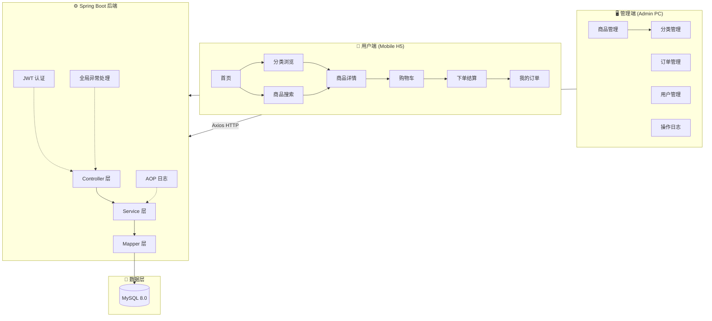
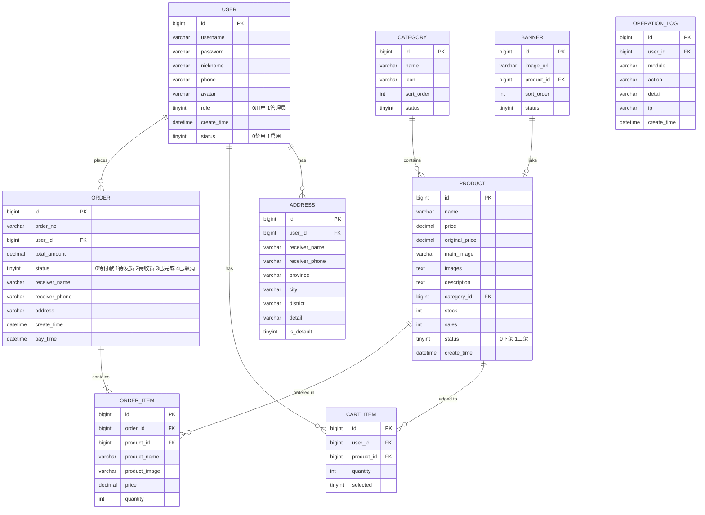

# PhoneMall 手机商城 - 项目设计文档

## 1. 系统架构

## 2. ER 图

## 3. 接口清单

### 3.1 认证模块 (AuthController)
| Method | Path | Description |
|--------|------|-------------|
| POST | /api/auth/register | 用户注册 |
| POST | /api/auth/login | 用户登录 |
| GET | /api/auth/info | 获取当前用户信息 |

### 3.2 商品模块 (ProductController)
| Method | Path | Description |
|--------|------|-------------|
| GET | /api/product/list | 商品列表(分页/搜索/分类筛选) |
| GET | /api/product/{id} | 商品详情 |
| GET | /api/product/hot | 热销商品 |
| GET | /api/product/recommend | 推荐商品 |

### 3.3 分类模块 (CategoryController)
| Method | Path | Description |
|--------|------|-------------|
| GET | /api/category/list | 分类列表 |

### 3.4 购物车模块 (CartController)
| Method | Path | Description |
|--------|------|-------------|
| GET | /api/cart/list | 购物车列表 |
| POST | /api/cart/add | 添加购物车 |
| PUT | /api/cart/update | 更新数量 |
| DELETE | /api/cart/delete/{id} | 删除购物车项 |
| PUT | /api/cart/select-all | 全选/取消全选 |

### 3.5 订单模块 (OrderController)
| Method | Path | Description |
|--------|------|-------------|
| POST | /api/order/create | 创建订单 |
| GET | /api/order/list | 我的订单列表 |
| GET | /api/order/{id} | 订单详情 |
| PUT | /api/order/cancel/{id} | 取消订单 |
| PUT | /api/order/confirm/{id} | 确认收货 |

### 3.6 地址模块 (AddressController)
| Method | Path | Description |
|--------|------|-------------|
| GET | /api/address/list | 地址列表 |
| POST | /api/address/save | 新增/编辑地址 |
| DELETE | /api/address/delete/{id} | 删除地址 |

### 3.7 轮播图 (BannerController)
| Method | Path | Description |
|--------|------|-------------|
| GET | /api/banner/list | 轮播图列表 |

### 3.8 管理端 (AdminController)
| Method | Path | Description |
|--------|------|-------------|
| GET | /api/admin/product/list | 商品管理列表 |
| POST | /api/admin/product/save | 新增/编辑商品 |
| PUT | /api/admin/product/status/{id} | 上下架 |
| DELETE | /api/admin/product/delete/{id} | 删除商品 |
| GET | /api/admin/order/list | 订单管理列表 |
| PUT | /api/admin/order/ship/{id} | 发货 |
| GET | /api/admin/user/list | 用户管理列表 |
| PUT | /api/admin/user/status/{id} | 禁用/启用用户 |
| GET | /api/admin/category/list | 分类管理 |
| POST | /api/admin/category/save | 新增/编辑分类 |
| DELETE | /api/admin/category/delete/{id} | 删除分类 |
| GET | /api/admin/banner/list | 轮播图管理 |
| POST | /api/admin/banner/save | 新增/编辑轮播图 |
| DELETE | /api/admin/banner/delete/{id} | 删除轮播图 |
| GET | /api/admin/log/list | 操作日志 |

## 4. UI/UX 规范

### 色彩体系
- 主色调: `#E4393C` (京东红)
- 辅助色: `#F5A623` (促销橙)
- 成功色: `#67C23A`
- 警告色: `#E6A23C`
- 危险色: `#F56C6C`
- 文字主色: `#333333`
- 文字次色: `#666666`
- 文字辅助: `#999999`
- 背景色: `#F5F5F5`
- 卡片背景: `#FFFFFF`
- 分割线: `#EEEEEE`

### 字体规范
- 标题: 18px / bold
- 正文: 14px / regular
- 辅助文字: 12px / regular
- 价格: 16-20px / bold / #E4393C

### 间距规范
- 页面边距: 16px
- 卡片间距: 12px
- 内容内边距: 12px-16px
- 元素间距: 8px

### 圆角规范
- 卡片: 8px
- 按钮: 20px (胶囊) / 4px (方形)
- 图片: 4px
- 输入框: 4px

### 阴影规范
- 卡片: `0 2px 12px rgba(0, 0, 0, 0.08)`
- 弹窗: `0 4px 24px rgba(0, 0, 0, 0.15)`
- 底部导航: `0 -2px 8px rgba(0, 0, 0, 0.06)`
